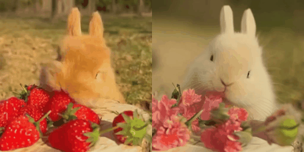
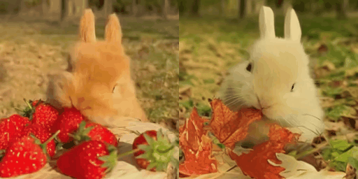
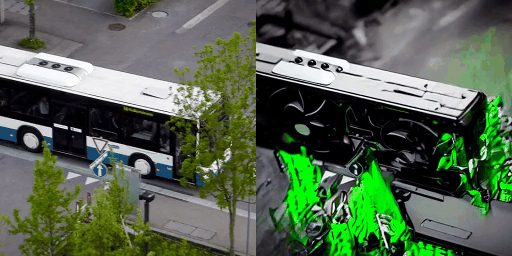
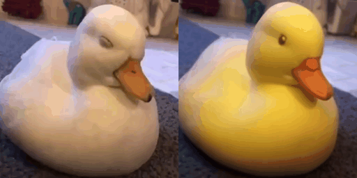
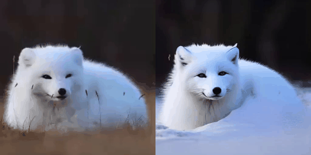
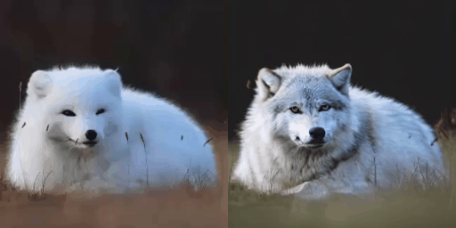

## FateZero: Fusing Attentions for Zero-shot Text-based Video Editing

[Chenyang Qi](https://chenyangqiqi.github.io/), [Xiaodong Cun](http://vinthony.github.io/), [Yong Zhang](https://yzhang2016.github.io), [Chenyang Lei](https://chenyanglei.github.io/), [Xintao Wang](https://xinntao.github.io/), [Ying Shan](https://scholar.google.com/citations?hl=zh-CN&user=4oXBp9UAAAAJ), and [Qifeng Chen](https://cqf.io)

<a href='https://arxiv.org/abs/2303.09535'></a> 
<a href='https://fate-zero-edit.github.io/'></a>  [](https://colab.research.google.com/github/ChenyangQiQi/FateZero/blob/main/colab_fatezero.ipynb)
[](https://github.com/ChenyangQiQi/FateZero)
 

<!--  -->

<table class="center">
  <td></td>
  <td></td>
  <tr>
  <td width=25% style="text-align:center;">"silver jeep ➜ posche car"</td>
  <td width=25% style="text-align:center;">"+ Van Gogh style"</td>
  <!-- <td width=25% style="text-align:center;">"Wonder Woman, wearing a cowboy hat, is skiing"</td>
  <td width=25% style="text-align:center;">"A man, wearing pink clothes, is skiing at sunset"</td> -->
</tr>
</table >

## Abstract
<b>TL;DR: Using FateZero, Edits your video via pretrained Diffusion models without training.</b>

<details><summary>CLICK for full abstract</summary>


> The diffusion-based generative models have achieved
remarkable success in text-based image generation. However,
since it contains enormous randomness in generation
progress, it is still challenging to apply such models for
real-world visual content editing, especially in videos. In
this paper, we propose FateZero, a zero-shot text-based editing method on real-world videos without per-prompt
training or use-specific mask. To edit videos consistently,
we propose several techniques based on the pre-trained
models. Firstly, in contrast to the straightforward DDIM
inversion technique, our approach captures intermediate
attention maps during inversion, which effectively retain
both structural and motion information. These maps are
directly fused in the editing process rather than generated
during denoising. To further minimize semantic leakage of
the source video, we then fuse self-attentions with a blending
mask obtained by cross-attention features from the source
prompt. Furthermore, we have implemented a reform of the
self-attention mechanism in denoising UNet by introducing
spatial-temporal attention to ensure frame consistency. Yet
succinct, our method is the first one to show the ability of
zero-shot text-driven video style and local attribute editing
from the trained text-to-image model. We also have a better
zero-shot shape-aware editing ability based on the text-tovideo
model. Extensive experiments demonstrate our
superior temporal consistency and editing capability than
previous works.
</details>

## Changelog
- 2023.03.27 Release [`attribute editing config`](config/attribute) and 
  <!-- [`data`](https://hkustconnect-my.sharepoint.com/:u:/g/personal/cqiaa_connect_ust_hk/Ee7J2IzZuaVGkefh-ZRp1GwB7RCUYU7MVJCKqeNWmOIpfg?e=dcOwb7) -->
  [`data`](https://github.com/ChenyangQiQi/FateZero/releases/download/v0.0.1/attribute.zip) used in the paper.
- 2023.03.22 Upload a `colab notebook` [](https://colab.research.google.com/github/ChenyangQiQi/FateZero/blob/main/colab_fatezero.ipynb). Enjoy the fun of zero-shot video-editing freely!
- 2023.03.22 Release [`style editing config`](config/style) and 
<!--[`data`](https://hkustconnect-my.sharepoint.com/:u:/g/personal/cqiaa_connect_ust_hk/EaTqRAuW0eJLj0z_JJrURkcBZCC3Zvgsdo6zsXHhpyHhHQ?e=FzuiNG) -->
[`data`](https://github.com/ChenyangQiQi/FateZero/releases/download/v0.0.1/style.zip)
used in the paper.
- 2023.03.21 [Editing guidance](docs/EditingGuidance.md) is provided to help users to edit in-the-wild video. Welcome to play and give feedback!
- 2023.03.21 Update the `codebase and configuration`. Now, it can run with lower resources (16G GPU and less than 16G CPU RAM) with [new configuration](config/low_resource_teaser) in `config/low_resource_teaser`. 
<!-- A new option store all the attentions in hard disk, which require less ram. -->
- 2023.03.17 Release Code and Paper!

## Todo

- [x] Release the edit config for teaser
- [x] Memory and runtime profiling
- [x] Hands-on guidance of hyperparameters tuning
- [x] Colab
- [x] Release configs for other result and in-the-wild dataset
  <!-- - [x] Style editing: done
  - [-] Attribute editing: in progress -->
- [-] hugging-face: inprogress
- [ ] Tune-a-video optimization and shape editing configs
- [ ] Release more application

## Setup Environment
Our method is tested using cuda11, fp16 of accelerator and xformers on a single A100 or 3090.

```bash
conda create -n fatezero38 python=3.8
conda activate fatezero38

pip install -r requirements.txt
```

`xformers` is recommended for A100 GPU to save memory and running time. 

<details><summary>Click for xformers installation </summary>

We find its installation not stable. You may try the following wheel:
```bash
wget https://github.com/ShivamShrirao/xformers-wheels/releases/download/4c06c79/xformers-0.0.15.dev0+4c06c79.d20221201-cp38-cp38-linux_x86_64.whl
pip install xformers-0.0.15.dev0+4c06c79.d20221201-cp38-cp38-linux_x86_64.whl
```

</details>

Validate the installation by 
```
python test_install.py
```

Our environment is similar to Tune-A-video ([official](https://github.com/showlab/Tune-A-Video), [unofficial](https://github.com/bryandlee/Tune-A-Video))  and [prompt-to-prompt](https://github.com/google/prompt-to-prompt/). You may check them for more details.


## FateZero Editing

#### Style and Attribute Editing in Teaser

Download the [stable diffusion v1-4](https://huggingface.co/CompVis/stable-diffusion-v1-4) (or other interesting image diffusion model) and put it to `./ckpt/stable-diffusion-v1-4`. 

<details><summary>Click for bash command: </summary>
 
```
mkdir ./ckpt
# download from huggingface face, takes 20G space
git lfs install
git clone https://huggingface.co/CompVis/stable-diffusion-v1-4
cd ./ckpt
ln -s ../stable-diffusion-v1-4 .
```
</details>

Then, you could reproduce style and shape editing result in our teaser by running:

```bash
accelerate launch test_fatezero.py --config config/teaser/jeep_watercolor.yaml
# or CUDA_VISIBLE_DEVICES=0 python test_fatezero.py --config config/teaser/jeep_watercolor.yaml
```

<details><summary>The result is saved at `./result` . (Click for directory structure) </summary>

```
result
├── teaser
│   ├── jeep_posche
│   ├── jeep_watercolor
│           ├── cross-attention  # visualization of cross-attention during inversion
│           ├── sample           # result
│           ├── train_samples    # the input video

```

</details>

Editing 8 frames on an Nvidia 3090, use `100G CPU memory, 12G GPU memory` for editing. We also provide some [`low cost setting`](config/low_resource_teaser) of style editing by different hyper-parameters on a 16GB GPU. 
You may try these low cost setting on colab.
[](https://colab.research.google.com/github/ChenyangQiQi/FateZero/blob/main/colab_fatezero.ipynb)

More the speed and hardware benchmark [here](docs/EditingGuidance.md#ddim-hyperparameters).

#### Shape and large motion editing with Tune-A-Video

Besides style and attribution editing above, we also provide a `Tune-A-Video` [checkpoint](https://hkustconnect-my.sharepoint.com/:f:/g/personal/cqiaa_connect_ust_hk/EviSTWoAOs1EmHtqZruq50kBZu1E8gxDknCPigSvsS96uQ?e=492khj). You may download the it and move it to `./ckpt/jeep_tuned_200/`.
<!-- We provide the [Tune-a-Video](https://drive.google.com/file/d/166eNbabM6TeJVy7hxol2gL1kUGKHi3Do/view?usp=share_link), you could download the data, unzip and put it to `data`. : -->

<details><summary>The directory structure should like this: (Click for directory structure) </summary>

```
ckpt
├── stable-diffusion-v1-4
├── jeep_tuned_200
...
data
├── car-turn
│   ├── 00000000.png
│   ├── 00000001.png
│   ├── ...
video_diffusion
```
</details>

You could reproduce the shape editing result in our teaser by running:

```bash
accelerate launch test_fatezero.py --config config/teaser/jeep_posche.yaml
```


### Reproduce other results in the paper (in progress)
<!-- Download the data of [style editing](https://hkustconnect-my.sharepoint.com/:u:/g/personal/cqiaa_connect_ust_hk/EaTqRAuW0eJLj0z_JJrURkcBZCC3Zvgsdo6zsXHhpyHhHQ?e=FzuiNG) and [attribute editing](https://hkustconnect-my.sharepoint.com/:u:/g/personal/cqiaa_connect_ust_hk/Ee7J2IzZuaVGkefh-ZRp1GwB7RCUYU7MVJCKqeNWmOIpfg?e=dcOwb7)
-->
Download the data of style editing and attribute editing
from [onedrive](https://hkustconnect-my.sharepoint.com/:f:/g/personal/cqiaa_connect_ust_hk/EkIeHj3CQiBNhm6iEEhJQZwBEBJNCGt3FsANmyqeAYbuXQ?e=FxYtJk) or from Github [Release](https://github.com/ChenyangQiQi/FateZero/releases/tag/v0.0.1).
<details><summary>Click for wget bash command: </summary>
 
```
wget https://github.com/ChenyangQiQi/FateZero/releases/download/v0.0.1/attribute.zip
wget https://github.com/ChenyangQiQi/FateZero/releases/download/v0.0.1/style.zip
```
</details>

Unzip and Place it in ['./data'](data). Then use the command in ['config/style'](config/style) and ['config/attribute'](config/attribute) to get the results.

The config of our tune-a-video ckpts will be updated latter.

## Tuning guidance to edit YOUR video
We provided a tuning guidance to edit in-the-wild video at [here](./docs/EditingGuidance.md). The work is still in progress. Welcome to give your feedback in issues.

## Style Editing Results with Stable Diffusion
We show the difference of source prompt and target prompt in the box below each video.

Note mp4 and gif files in this github page are compressed. 
Please check our [Project Page](https://fate-zero-edit.github.io/) for mp4 files of original video editing results.
<table class="center">

<tr>
  <td></td>
  <td></td>
    <td></td>
  <!-- <td></td>              
  <td></td> -->
</tr>
<tr>
  <td width=25% style="text-align:center;">"+ Ukiyo-e style"</td>
  <td width=25% style="text-align:center;">"+ watercolor painting"</td>
  <td width=25% style="text-align:center;">"+ Monet style"</td>
</tr>

<tr>
  <td></td>
  <td></td>
  <td></td>

</tr>
<tr>

</tr>
<tr>
  <td width=25% style="text-align:center;">"+ Pokémon cartoon style"</td>
  <td width=25% style="text-align:center;">"+ Makoto Shinkai style"</td>
  <td width=25% style="text-align:center;">"+ cartoon style"</td>
</tr>
</table>

## Attribute Editing Results with Stable Diffusion
<table class="center">

<tr>

  <td></td>
  <td></td>
  <td></td>

</tr>
<tr>
  <td width=25% style="text-align:center;">"rabbit, strawberry ➜ white rabbit, flower"</td>
  <td width=25% style="text-align:center;">"rabbit, strawberry ➜ squirrel, carrot"</td>
  <td width=25% style="text-align:center;">"rabbit, strawberry ➜ white rabbit, leaves"</td>

</tr>
<tr>

  <td></td>
  <td></td>
  <td></td>

</tr>
<tr>
  <td width=25% style="text-align:center;">"squirrel ➜ robot squirrel"</td>
  <td width=25% style="text-align:center;">"squirrel, Carrot ➜ rabbit, eggplant"</td>
  <td width=25% style="text-align:center;">"squirrel, Carrot ➜ robot mouse, screwdriver"</td>

</tr>

<tr>

  <td></td>
  <td></td>
  <td></td>

</tr>
<tr>
  <td width=25% style="text-align:center;">"bear ➜ a red tiger"</td>
  <td width=25% style="text-align:center;">"bear ➜ a yellow leopard"</td>
  <td width=25% style="text-align:center;">"bear ➜ a brown lion"</td>

</tr>
<tr>

  <td></td>
  <td></td>
  <td></td>

</tr>
<tr>
  <td width=25% style="text-align:center;">"cat ➜ black cat, grass..."</td>
  <td width=25% style="text-align:center;">"cat ➜ red tiger"</td>
  <td width=25% style="text-align:center;">"cat ➜ Shiba-Inu"</td>

</tr>

<tr>

  <td></td>
  <td></td>
  <td></td>

</tr>
<tr>
  <td width=25% style="text-align:center;">"bus ➜ GPU"</td>
  <td width=25% style="text-align:center;">"gray dog ➜ yellow corgi"</td>
  <td width=25% style="text-align:center;">"gray dog ➜ robotic dog"</td>

</tr>
<tr>

  <td></td>
  <td></td>
  <td></td>

</tr>
<tr>
  <td width=25% style="text-align:center;">"white duck ➜ yellow rubber duck"</td>
  <td width=25% style="text-align:center;">"grass ➜ snow"</td>
  <td width=25% style="text-align:center;">"white fox ➜ grey wolf"</td>

</tr>


</table>

## Shape and large motion editing with Tune-A-Video
<table class="center">

<tr>
  <td></td>
  <td></td>
    <td></td>
  <!-- <td></td>              
  <td></td> -->
</tr>
<tr>
  <td width=25% style="text-align:center;">"silver jeep ➜ posche car"</td>
  <td width=25% style="text-align:center;">"Swan ➜ White Duck"</td>
  <td width=25% style="text-align:center;">"Swan ➜ Pink flamingo"</td>
</tr>

<tr>
  <td></td>
  <td></td>
  <td></td>

</tr>
<tr>

</tr>
<tr>
  <td width=25% style="text-align:center;">"A man ➜ A Batman"</td>
  <td width=25% style="text-align:center;">"A man ➜ A Wonder Woman, With cowboy hat"</td>
  <td width=25% style="text-align:center;">"A man ➜ A Spider-Man"</td>
</tr>
</table>


## Demo Video

https://user-images.githubusercontent.com/45789244/225698509-79c14793-3153-4bba-9d6e-ede7d811d7f8.mp4

The video here is compressed due to the size limit of github.
The original full resolution video is [here](https://hkustconnect-my.sharepoint.com/:v:/g/personal/cqiaa_connect_ust_hk/EXKDI_nahEhKtiYPvvyU9SkBDTG2W4G1AZ_vkC7ekh3ENw?e=Xhgtmk).


## Citation 

```
@misc{qi2023fatezero,
      title={FateZero: Fusing Attentions for Zero-shot Text-based Video Editing}, 
      author={Chenyang Qi and Xiaodong Cun and Yong Zhang and Chenyang Lei and Xintao Wang and Ying Shan and Qifeng Chen},
      year={2023},
      eprint={2303.09535},
      archivePrefix={arXiv},
      primaryClass={cs.CV}
}
``` 


## Acknowledgements

This repository borrows heavily from [Tune-A-Video](https://github.com/showlab/Tune-A-Video) and [prompt-to-prompt](https://github.com/google/prompt-to-prompt/). thanks the authors for sharing their code and models.

## Maintenance

This is the codebase for our research work. We are still working hard to update this repo and more details are coming in days. If you have any questions or ideas to discuss, feel free to contact [Chenyang Qi](cqiaa@connect.ust.hk) or [Xiaodong Cun](vinthony@gmail.com).

