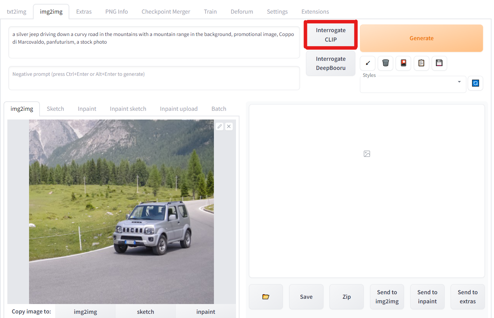

# TuningGuidance

## Prompt Engineering
For the results in the paper and webpage, we get the source prompt using the BLIP model embedded in the [Stable Diffusion WebUI](https://github.com/AUTOMATIC1111/stable-diffusion-webui/).

Click the "interrogate CLIP", and we will get a source prompt automatically. Then, we remove the last few useless words.

 

During stylization, you may use a very simple source prompt "A photo" as a baseline if your input video is too complicated to describe by one sentence.

### Validate the prompt

- Put the source prompt into the stable diffusion. If the generated image is close to our input video, it can be a good source prompt.
- A good prompt describes each frame and most objects in video. Especially, it has the object or attribute that we want to edit or preserve.
- Put the target prompt into the stable diffusion. We can check the upper bound of our editing effect. A reasonable composition of video may achieve better results(e.g., "sunflower" video with "Van Gogh" prompt is better than "sunflower" with "Monet")


## FateZero hyperparameters
We give a simple analysis of the involved hyperparaters as follows:
``` yaml
# Whether to directly copy the cross attention from source 
# True: directly copy, better for object replacement
# False: keep source attention, better for style
is_replace_controller: False

# Semantic layout preserving. High steps, replace more cross attention to preserve semantic layout
cross_replace_steps: 
    default_: 0.8

# Source background structure preserving, in [0, 1]. 
# e.g., =0.6 Replace the first 60% steps self-attention
self_replace_steps: 0.8


# Amplify the target-words cross attention, larger value, more close to target
# eq_params: 
#     words: ["", ""]
#     values: [10,10] 

# Target structure-divergence hyperparames
# If you change the shape of object, it is better to use all three line; otherwise, no need.
# Without following three lines, all self-attention will be replaced
blend_words: [['jeep',], ["car",]] 
masked_self_attention:  True
# masked_latents: False   # Directly copy the latents, performance not so good in our case            
bend_th: [2, 2]
# preserve source structure of blend_words in [0, 1]
# default is bend_th: [2, 2]  # replace full-resolution edit source with self-attention 
# bend_th-> [0.0, 0.0], mask -> 1, use more edit self-attention, more generated shape, less source acttention
```


## DDIM hyperparameters
We profile the cost of editing 8 frames on an Nvidia 3090, fp16 of accelerator, xformers.

| Setting | CPU memory         | GPU memory        | Inversion time | Editing time time | Quality
|------------------|------------------  |------------------|------------------|------------------|------------------|
| 50 steps DDIM  | 100G    | 12G  | 60 seconds | 40 seconds | Full support
| 10 steps DDIM  | 15G    | 12G  | 10 seconds | 10 seconds | OK for Style, not work for shape
| 10 steps DDIM, store on disk  | 6G    | 12G  | 33 seconds | 100 seconds | OK for Style, not work for shape
